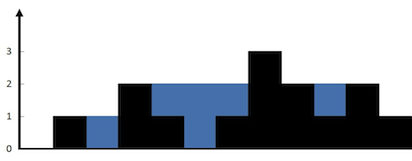

# Trapping Rain Water
|Category|Difficulty|Likes|Dislikes|
|-|-|-|-|
|algorithms|Hard (46.04%)|5466|104|

## Tags
array | two-pointers | stack

## Companies
amazon | apple | bloomberg | google | twitter | zenefits
```
Given n non-negative integers representing an elevation map where the width of each bar is 1, compute how much water it is able to trap after raining.
```

```
The above elevation map is represented by array [0,1,0,2,1,0,1,3,2,1,2,1]. In this case, 6 units of rain water (blue section) are being trapped. Thanks Marcos for contributing this image!
```

## Example:
```
Input: [0,1,0,2,1,0,1,3,2,1,2,1]
Output: 6
```

## Python
```
√ Accepted
  √ 315/315 cases passed (48 ms)
  √ Your runtime beats 85.53 % of python3 submissions
  √ Your memory usage beats 100 % of python3 submissions (13.3 MB)
```